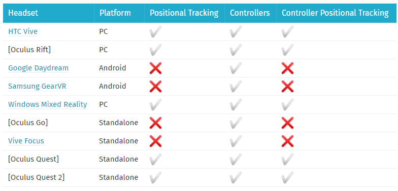
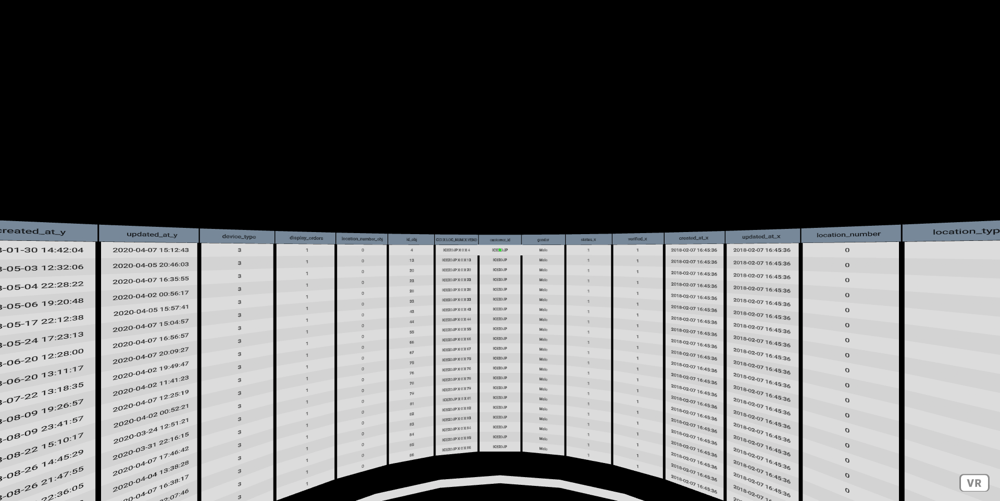
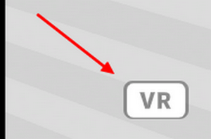
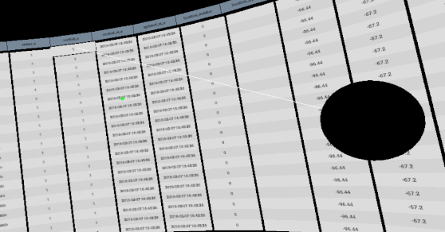
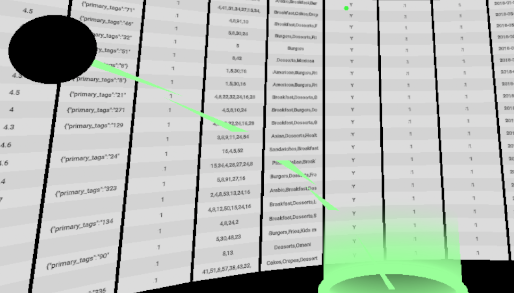
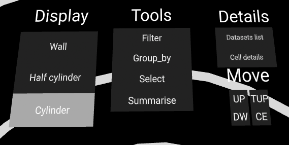
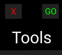

# Excel 2077

Interface de visualisation et traitement de données en VR utilisant la technologie Web

## Sommaire

* [Prérequis](#prérequis)
* [Installation du projet](#installation-du-projet)
* [Lancement](#lancement)
* [Utilisation](#utilisation)
    * [Démarrage](#démarrage)
    * [Contrôles](#contrôles)
    * [La ceinture d'outils](#la-ceinture-doutils)

## Prérequis
* Node
* Gestionnaire de paquets npm
* L'URL d'une instance accessible de notre API RServer (https://git.unistra.fr/projet-master/rserver)
* SteamVR (si l'accès est fait depuis un PC)
* Navigateur compatible avec la WebXR Device API

## Compatibilités
Casques et manettes compatibles avec le framework A-frame utilisé :


(source: https://aframe.io/docs/1.1.0/introduction/vr-headsets-and-webvr-browsers.html)

La technologie utilise la WebXR Device API, le navigateur web utilisé doit être compatible avec cette dernière. Nous conseillons une version récente de Mozilla Firefox ou Google Chrome sous Windows (**WebXR n'est pas supporté sous système Linux**).

## Installation du projet

### Installation des dépendances
Lancez la commande :
```bash
npm install
```

### Configuration
Compléter le fichier ./src/.env.js afin qu'il corresponde à la configuration voulue :
```js
export const config = {
    RSERVER_URL:"http://localhost:3000/", // !! Must contain the final '/'
    DATASET:"custom_dataset.csv" //Server will load file "[...]/rserver/{DATASET}"
};
```
* La variable **RSERVER_URL** correspond à l'url de l'instance du RServer, cette url **doit comporter le '/' final** afin de garantir le bon fonctionnement.
* La variable **DATASET** correspond au chemin du fichier présent dans le RServer que l'on souhaite charger, **ce chemin est à définir par rapport à la racine du projet RServer**. Par exemple :
    * `DATASET:"custom_dataset.csv"` chargera `rserver/custom_dataset.csv`
    * `DATASET:"my_datasets/another_dataset.csv"` chargera `rserver/my_datasets/another_dataset.csv`

## Lancement
Lancez la commande :
```bash
npm start
```
Une fois terminé, le site est accessible à l'adresse `http://localhost:9000/`

## Utilisation

### Démarrage

Rendez-vous sur `http://localhost:9000` avec votre navigateur, patientez le temps que les données soient chargées. Lorsque le chargement est terminé, vous devez voir une page similaire à celle-ci :


Pour entrer dans le mode VR, assurez vous d'avoir branché votre casque et démarré SteamVR, puis cliquer sur l'icône "VR" visible dans le coin inférieur droit de l'écran. (Il se peut que votre navigateur vous demande l'autorisation d'utiliser votre matériel VR).




### Contrôles
#### Sans VR
Notez qu'il est possible d'utiliser cette interface sans casque (à l'exception de la commande 'filter' et de l'affichage des détails d'une cellule).

* Déplacements avec les touches Z,Q,S et D du clavier
* Contrôle de la caméra en bougeant la souris tout en laissant le clic gauche enfoncé
* Interaction en effectuant un clic gauche tout en s'assurant que l'objet est pointé par le point vert disposé au centre de l'écran.

#### En VR
* Déplacez-vous librement dans votre pièce et bougez votre tête pour changer de point de vue.
* La manette droite sert de pointeur, sa gâchette effectuera un "clic" sur l'objet pointé.
    * 
* La manette gauche permet de déclencher une téléportation, afin de se déplacer sur une grand distance. Appuyez sur la gâchette pour faire apparaître la zone de téléportation puis relâcher la afin de la déclencher vers l'endroit ciblé.
    * 

### La ceinture d'outils
En regardant vers le bas, vous faites apparaître une ceinture d'outils.



#### Catégorie "Display"
Les boutons sous la catégorie "Display" contrôlent la manière dont s'affiche le tableau de données.
* **Wall** : le tableau prend la forme d'un mur plat (utile quand il y a très peu de colonnes)
* **Half cylinder** : le tableau prend la forme d'un mur courbé sous forme d'un demi cercle (utile avec un nombre modéré de colonnes, < 15)
* **Cylinder** : le tableau prend la forme d'un cylindre creux, permettant d'être au centre des données (affichage par défaut, utile avec un nombre de colonnes élevé, > 15 )

#### Catégorie "Details"
Ces boutons font apparaître des informations complémentaires à l'écran
* **Datasets list** : affiche la liste des différents tableaux chargés (historique de commande) et permet de basculer de l'un à l'autre
* **Cell details** : affiche une petite fenêtre au niveau de la manette droite, celle-ci donne des informations sur la dernière cellule de tableau cliquée

#### Catégorie "Move"
Dans cette catégorie, vous retrouverez des boutons permettant des déplacements non pris en charge par la téléportation.
* **UP** : fait monter votre point de vue
* **DW** : fait descendre votre point de vue (Down)
* **TUP** : réinitialise la position verticale au point de départ, c'est à dire au haut du tableau (Top Up)
* **CE** : réinitialise la position sur le plan afin de recentrer votre position dans la scène (Center)

#### Catégorie "Tools"
C'est dans cette catégorie que vous retrouverez les commandes R pouvant être appelées par le programme, lorsqu'une commande est sélectionnée, deux boutons supplémentaires apparaissent au dessus du texte "Tools" :



* **X** sert à annuler les éventuelles sélections réalisées pour la commande actuelle
* **GO** sert à demander l'exécution de la commande (à condition que les paramètres soient corrects)

La démarche a suivre pour déterminer les paramètres diffère d'une commande à l'autre :
* **Select** : Cliquez sur ***le nom*** des colonnes pour les ajouter/enlever de la sélection, puis sur le bouton **GO**
* **Group_by** : Cliquez sur ***le nom*** de la colonne sur laquelle vous souhaitez l'utiliser, puis sur le bouton **GO**
* **Summarise** : Cliquez sur l'une des opérations qui s'affiche devant vous (puis sur ***le nom*** d'une colonne si elle en nécessite une), ensuite cliquez sur le bouton **GO** (vous pouvez demander plusieurs opérations différentes dans un même summarise)
* **Filter** : Cliquez sur ***le nom*** de la colonne sur laquelle vous souhaitez l'utiliser, un clavier virtuel va s'afficher devant vous, sélectionnez un opérateur de comparaison et cliquez sur les touches afin de saisir l'élément de comparaison. Enfin, cliquez sur le bouton **GO** (vous pouvez créer plusieurs filtres dans une même commande filter)
